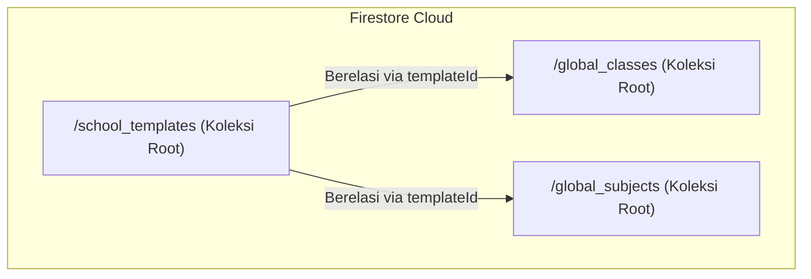
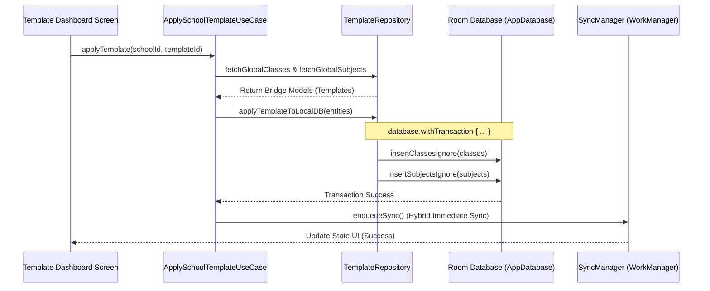

# 🏫 Kontrak Data & Arsitektur Sinkronisasi Template Sekolah (v1.0.0)

Dokumen arsitektur ini mendefinisikan struktur data, skema koleksi Firestore, model Room, logika transaksi, dan kebijakan penanganan konflik untuk fitur **School Template Dashboard** di Azura-Time.

---

## 1. Skema Koleksi Firestore (Root Collections)

Untuk efisiensi penyimpanan, pembaruan global yang tersentralisasi, dan pengurangan redundansi, kita menggunakan arsitektur **Root Collections** pada Firebase Firestore:



### A. Skema Dokumen `/school_templates/{templateId}`
Koleksi ini berisi metadata dari template kurikulum sekolah (contoh: Kurikulum Merdeka SMA, KTSP SMP, dll.).
```json
{
  "templateId": "sma_merdeka_sains",
  "name": "Kurikulum Merdeka - SMA IPA",
  "description": "Template standar untuk SMA jurusan Ilmu Pengetahuan Alam dengan Kurikulum Merdeka.",
  "region": "nasional",
  "createdAt": 1781700000000
}
```

### B. Skema Dokumen `/global_classes/{classId}`
Menyimpan struktur kelas template yang terikat ke `templateId`.
```json
{
  "classTemplateId": "class_tmp_10_ipa_1",
  "templateId": "sma_merdeka_sains",
  "name": "10-IPA-1",
  "grade": "10",
  "description": "Kelas 10 Peminatan MIPA 1"
}
```

### C. Skema Dokumen `/global_subjects/{subjectId}`
Menyimpan struktur mata pelajaran template yang terikat ke `templateId`.
```json
{
  "subjectTemplateId": "subj_tmp_math_10",
  "templateId": "sma_merdeka_sains",
  "name": "Matematika Wajib Kelas 10",
  "description": "Mata pelajaran Matematika wajib untuk kelas 10."
}
```

---

## 2. Definisi Jembatan Model (Kotlin Data Layer)

Model-model berikut berfungsi sebagai jembatan/transfer data (DTO) dari Firestore sebelum dipetakan ke entitas Room:

```kotlin
package com.azuratech.azuratime.features.template.domain.model

/**
 * 📂 Bridge Model untuk Template Sekolah
 */
data class SchoolTemplate(
    val id: String = "",
    val name: String = "",
    val category: String = "", // "SD", "SMP", "SMA", dll.
    val description: String = "",
    val defaultClassIds: List<String> = emptyList(),
    val defaultSubjectIds: List<String> = emptyList(),
    val isActive: Boolean = true,
)

/**
 * 🏫 Bridge Model untuk Template Kelas
 */
data class ClassTemplate(
    val id: String = "",
    val name: String = "",
    val level: Int = 0,
    val major: String = "",
    val section: String = "",
    val category: String = "",
    val active: Boolean = true,
)

/**
 * 📚 Bridge Model untuk Template Mata Pelajaran
 */
data class SubjectTemplate(
    val id: String = "",
    val name: String = "",
    val category: String = "",
    val active: Boolean = true,
)
```

---

## 3. Strategi Pemetaan (Mapping Strategy) ke Room DB

Ketika admin memilih untuk menerapkan template, data dari koleksi Firestore `global_classes` dan `global_subjects` harus dipetakan ke dalam format entitas lokal [ClassEntity](file:///home/max/azuratime/nusantara-main/app/src/main/java/com/azuratech/azuratime/features/school/data/local/ClassEntity.kt) dan [SubjectEntity](file:///home/max/azuratime/nusantara-main/app/src/main/java/com/azuratech/azuratime/features/session/data/local/SubjectEntity.kt).

### Aturan Pemetaan Bidang (Field Mapping Rules):

#### A. `ClassTemplate` ➔ `ClassEntity`
```kotlin
fun ClassTemplate.toLocalEntity(
    activeSchoolId: String, 
    ownerId: String
): ClassEntity {
    return ClassEntity(
        id = UUID.randomUUID().toString(), // Membuat ID unik baru untuk sekolah ini
        schoolId = activeSchoolId,
        ownerAccountId = ownerId,
        name = this.name,
        grade = this.level.toString(), // level dipetakan ke grade string
        accountId = null, // Kosong secara default, nanti ditugaskan oleh admin
        studentCount = 0,
        createdAt = System.currentTimeMillis(),
        isSynced = false // 🔥 Wajib FALSE agar diunggah oleh SyncManager
    )
}
```

#### B. `SubjectTemplate` ➔ `SubjectEntity`
```kotlin
fun SubjectTemplate.toLocalEntity(
    activeSchoolId: String
): SubjectEntity {
    return SubjectEntity(
        subjectId = UUID.randomUUID().toString(), // Membuat ID unik baru
        name = this.name,
        description = null, // Ditingkatkan tanpa deskripsi bawaan dari template
        schoolId = activeSchoolId,
        isActive = true,
        isSynced = false // 🔥 Wajib FALSE agar diunggah oleh SyncManager
    )
}
```

---

## 4. Alur Transaksional (Atomic Sync)

Untuk menjamin konsistensi status lokal dan cloud (All-or-Nothing), proses penerapan template wajib dibungkus dalam transaksi database lokal menggunakan `database.withTransaction {}` di [AppDatabase](file:///home/max/azuratime/nusantara-main/app/src/main/java/com/azuratech/azuratime/core/data/local/AppDatabase.kt) serta memanfaatkan sinkronisasi responsif via [SyncManager](file:///home/max/azuratime/nusantara-main/app/src/main/java/com/azuratech/azuratime/core/sync/SyncManager.kt).



### Panduan Kode untuk Logika Transaksi:
```kotlin
suspend fun applyTemplateToSchool(
    schoolId: String,
    ownerId: String,
    classes: List<ClassTemplate>,
    subjects: List<SubjectTemplate>
): Result<Unit> = withContext(Dispatchers.IO) {
    try {
        database.withTransaction {
            val localClasses = classes.map { it.toLocalEntity(schoolId, ownerId) }
            val localSubjects = subjects.map { it.toLocalEntity(schoolId) }
            
            // Simpan ke SQLite menggunakan metode IGNORE
            if (localClasses.isNotEmpty()) {
                classDao.insertClassesIgnore(localClasses)
            }
            if (localSubjects.isNotEmpty()) {
                sessionDao.insertSubjectsIgnore(localSubjects)
            }
        }
        
        // 🔥 Trigger sinkronisasi instan agar data lokal segera dipush ke cloud sekolah
        syncManager.enqueueSync()
        
        Result.Success(Unit)
    } catch (e: Exception) {
        Result.Failure(AppError.LocalDB(e.message))
    }
}
```

---

## 5. Keamanan Data Lokal & Aturan Konflik (OnConflictStrategy.IGNORE)

Kebijakan **`OnConflictStrategy.IGNORE`** ditetapkan sebagai aturan emas arsitektur guna melindungi kustomisasi manual yang telah dibuat oleh Admin sekolah lokal.

### Mengapa menggunakan `IGNORE`, bukan `REPLACE`?
1. **Perlindungan Kustomisasi Lokal**: Jika admin sekolah telah mengubah nama kelas (misalnya mengubah `10-IPA-1` menjadi `10-MIPA-Unggulan`), operasi pengunduhan ulang atau pembaruan template tidak boleh menimpa perubahan tersebut.
2. **Keamanan offline**: Saat sistem melakukan sinkronisasi ulang, penggunaan `IGNORE` memastikan tidak ada data lokal yang terhapus secara tidak sengaja oleh skema template bawaan.
3. **Pemberlakuan**: Semua fungsi insert lokal pada DAO yang menangani data template harus anotasikan dengan `@Insert(onConflict = OnConflictStrategy.IGNORE)`.
